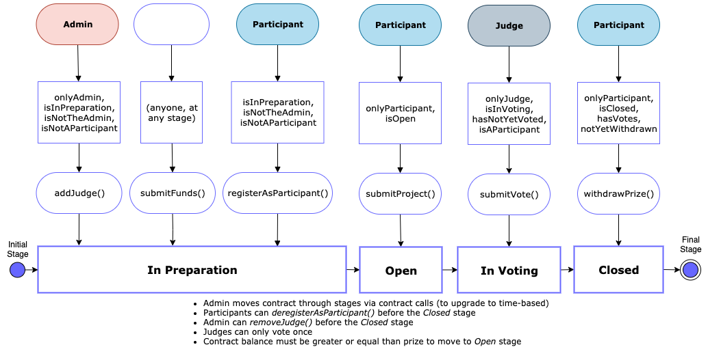

# Welcome to Decentralized Hackathons!

## Description

The purpose of this project is to transitin online Hackathons to the blockchain as smoothly as possible, therefore the idea main design considerations was to replicate the online hackathon process as accurately and seamlessly as possible within the ethereum blockchain context.

---

To Remember:
  - On video demo, mention all the TO-DO/Nice-to-haves and explain how this can be generalized for any type of competition
      enforce expected prize
  - On video, end with a shameless plug to get hired
  - Partcipants can gorup themselves in teams
  - Submission are link only, contents can be modified past the close date.
  - Time based opening and closing
  - Controlled participant registration, by number of granting access
  - Sponsors
  - Separate to new test file the state set-up functions

  - Update Balance display after submitFunds runs    ----- DONE
  - Not found DH page, reroute or error    ------- DONE
  - NavBAr  ------- DONE
  - Contract Balance display also for Factory Contract, and State, on DHCard  ----- DONE
  - way to click out of pop up, to go back  ------ DONE
  - Get events working right and neatly   -------- DONE
  - display more recent DH first  ------- DONE

  - display judges and participants via store-reducer-loop ------- DONE
  - show projects submitted by whom  ------- DONE
  - show if project/participant has a vote & can therefore call withdrawPrize ------ DONE
  
  - Allow proper login, MM-enable, with the MM button
  - Dont remove pop-up until interaction with MM is achieved, and show loading button
  - form validation for EOA for judges, participants, etc
  - Block OpenDHFn if balance not great to Prize   
  - change size and beautify of DHackathon components instructions
  - Allow to submit funds along with OpenDH call
  
  - After DH creation redirect to new DH page 
  - make input size variable
  - Add Loading Container
  - specific event configuration for each type of event to display its returned values
  - make the contracts upgradeable
  - Make factory contract (and DHackathon ones) Mortal and/or Autodeprecation

To Publish:
  - UML of process, stages, actors and functions
  - Instruction page with UML and caveats, exceptions, requires
  - Properly document own github repo according to requirements
  - in DHackathon instructions and graph

  - Host project
  - Youtube videos about usage
  - Medium Post
  - Post on reddit, product hunt, etc, devpost
  - email companies about engagement / job opps
  - Ubuntu compatibility to replicate
  

To Share with Amal:
  - proper config of web3 when adding new contract
  - ability to get returned values both via events in middleware or via transaction receipt in State
  - instant handling of metamask EOA update
  - Pop-up components for gathering user input

Hours:
3 on Thursday 12th
2.5 on Friday 13th
3 on Sat 14th
1 on Sun 15th
1 on Tuesday 17th
3 on Thursday 19th
3 on Saturday 21st