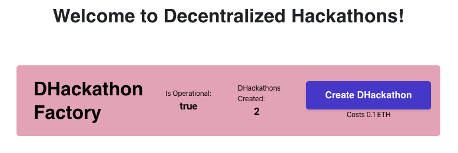

# Avoiding Common Attacks
---

As one of the topic I prioritized on the platform design, this document explains how Zalarify avoids common attacks.
Care was taken to avoid common attacks while developing the smart contracts. However, use at your own risk.

## Re-entracy

The smart contracts don't interact with external smart contracts. Moreover, the credit-withdrawal design patterns was always used (as opposed to the force sending) as evidenced by the `withdrawFunds` function in the `DHackathonFactory` contract and the `withdrawPrize` function in the `DHackathon` contract.

## Transaction Ordering and Timestamp Dependence

Though the DHackathon app has states, it does not heavily depend on the order in which transactions are added to blocks. Also, given the number of roles/actors the time interval between the expected order of functione execution is quite large. 

Timestamps are used only in the `DHackathonFactory` contract to set the `createdOn` property of the newly minted `DHackathon` contracts when an externally owned account (EOA) calls the `createDHackathon` function. 
```
newDH = new DHackathon(counter, _name, msg.sender, _prize, block.timestamp);
```
The `createdOn` property is rather unimportant. If miners were to manipulate it by a few seconds, no serious consequences would occur.

## Overflow and Underflow

OpenZeppelin's ```SafeMath.sol``` library was utilized. It can be found [here](https://github.com/OpenZeppelin/openzeppelin-contracts/blob/master/contracts/math/SafeMath.sol).

## Denial of Service

The smart contracts don't interact with external smart contracts and when sending ether to EOAs the credit-withdrawal design pattern was used as evidenced in the
`withdrawFunds` and `withdrawPrize` functions.

## Denial of Service by Block Gas Limit (or startGas)

To prevent this attack, no while nor for loops were utilized.

## Force Sending Ether

To prevent this attack, no core logic is based upon the contract's balance. Moreover, the credit-withdraw pattern was always preferred in place of force sending.

## Roles and State

Roles (Admin, Judge, Participant) were implement in the `DHackathon` contracts to control who calls them. OpenZeppelin's Roles library was leveraged for this, it can be found [here](https://github.com/OpenZeppelin/openzeppelin-contracts/blob/master/contracts/access/Roles.sol). Modifiers checking the appropriate roles were added to all relevant functions, see the inherited `Judge.sol` and `Participant.sol`.

Similarly, state management was implemented on the `DHackathon` contracts, via relevant modifiers inherited from `StateTracker.sol`.

