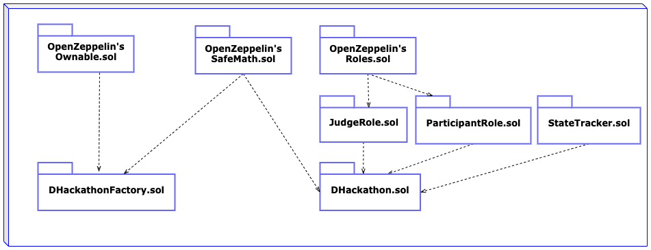

# Design Pattern Decisions
---

## DHackathon Factory

A modular, factory-child design pattern was utilized where anyone can call the `createDHackathon` function of the `DHackathonFactory` contract to instantiate and become the _admin_ of a newly minted `DHackathon` contract. This design decision limits the responsibilities of the `DHackathonFactory` contract to only 3 functions (`createDHackathon`, `shutdown`, `withdrawFunds`) and two types of users, the _owner_ and everyone else. 

### Modularity and inheritance
This contract inherits the `Ownable.sol` contract from OpenZeppelin to first leverage the `onlyOwner` modifier and make the `shutdown` \& `withdrawFunds` functions only accessible to the _owner_ and to allow the owner to `transferOwnership` and `renounceOwnership`. It also inherits and applies the `SafeMath` _library_ to all uint types to prevent under- and overflow.

### `createDHackathon` function

This function was designed to be called by anyone (including the _owner_). Given that we believe the functionality of the `DHackathon` contract — to seamleslly conduct a Hackathon in a decentralized manner is valuable — it has a cost of 0.1 ETH. This function instantiates a new `DHackathon` contract assigning _Admin_ priviledges to the caller, and keeps a record of the newly minted contract via mapping-struct combination for accountability purposes. The caller must specify what `name` and `prize` the `DHackathon` will have. The contract's balance will have to be greater or equal to the promised `prize` for the `DHackathon` contract to change to the `Open` state.

### Circuit Breaker — `shutdown` function

The `shutdown` function is a circuit breaker that blocks the `createDHackathon` function. It was created in case any bugs are found within the `DHackathon` contract which is the one that hosts most of the functionality of this platform. The `withdrawFunds` funds was not blocked as it is restricted to the _owner_ via a modifier.
```
bool public operational = true;

modifier isOperational() {
    require(operational == true, "This contract has been stopped by the owner.");
    _;
}

function shutdown()
        public
        onlyOwner()
    {
        operational = !operational;
    }
```

The `operational` state variable was kept public as it is rendered in the UI to discourage everyone from calling `createDHackathon` when it is blocked.

### `withdrawFunds` function

This function is restricted to the _owner_ and it sends the contract's balance, accumulated from DHackathon creations, to the _owner_. Note this function is an example of the **withdrawal pattern** being preferred over the push send pattern.

---


## DHackathon

The DHackathon contracts are minted by the `DHackathonFactory` contract. This design pattern makes each `DHackathon` contract modular and independent. Once instantiated, it has no concern or need for the `DHackathonFactory` that created it.

### Modularity and inheritance

This contract inherits the `JudgeRole`, `ParticipantRole`, and `StateTracker`, the first two inheriting the `Roles` library from OpenZeppelin. The `DHackathon` contract also inherits and applies the `SafeMath` _library_ to all uint types to prevent under- and overflow.

### Roles

The `DHackathon` contract has 3 roles and therefore 4 types of users: _Admin_, _Judge_, _Participant_, everyone else (no role). Roles are utilized to accurately represents how hackathons are conducted, but also to restrict function access. For example, the only state-changing functions that have open access, i.e. can be called by anyone, are the   `submitFunds` function and the `registerAsParticipant` function. Modifiers from `JudgeRole` and `ParticipantRole` contract were utilized to enforce this behavior. Below a list of the functions available to each role.


+ **Admin:**  `addJuge(address _account)` and `removeJudge(address _account)` to handle who the judge role, and functions to move the `DHackathon` through its stages like: `openDHackathon()`, `toVotingDHackathon()`, and `closeDHackathon()`.
+ **Judge:** can `submitVote(address _proposedWinner)` to choose its elected winnner.
+ **Participant:** can only `submitProject(string _url)` to deliver the location of their Hackathon project, and `withdrawPrize` to retrieve part of the prize if it received any votes by the Judges.
+ **Anyone:** Any externally owned account (EOA) can `registerAsAParticipant()` therefore gaining access to the Participant Role priviledges. Any EOA, including ones with assigned roles, can `submitFunds()` that will be accumulated in the `DHackathon` contract as the prize to be withdrawn by the winners.

Notice the _Admin_ has no say on the selection of the winner or the delivery of the prize. To further decentralize this contract, the stage changes can be time based. Furthermore, the election of judges can be done by a voting mechanism.


### States

The `StateTracker` contract keeps track of what stage the `DHackathon` is on. Using modifiers, functions are restricted to the particular stage in the `DHackathon` when they are expected. This design pattern, like the Roles, accurately represents how hackathons are conducted while helping to restrict function access therefore limiting the possibilities for malicious action or bugs. The stages that each `Hackathon` contract is expected to go through are: _In Preparation_, _Open_, _In Voting_, _Closed_. Modifiers from `State Tracker` are utilized to enforce this behavior. Below a list of the allowed functionality on each stage.

+ **In Preparation:** 
  + *Admin:* `addJudge`, `removeJudge`, `openDHackathon`
  + *Judge:* -
  + *Participant:* `deregisterAsParticipant`
  + *No role:* `registerAsParticipant`
+ **Open:**
  + *Admin:* `toVotingDHackathon`, `removeJudge`
  + *Judge:* -
  + *Participant:* `submitProject`, `deregisterAsParticipant`
  + *No role:* -
+ **In Voting:**
  + *Admin:* `closeDHackathon`, `removeJudge`
  + *Judge:* `submitVote`
  + *Participant:* `deregisterAsParticipant`
  + *No role:* -
+ **Closed:**
  + *Admin:* -
  + *Judge:* -
  + *Participant:* `withdrawPrize`
  + *No role:* 

With the caveat, that anyone, with role or without role, can call `submitFunds`, `balance`, `isAdmin` at any stage.

To change the `DHackathon` state from _In Preparation_ to _Open_ the contract's balance must be equal or greater than the _prize_ the _Admin_ declared when calling the `createDHackathon` function from the `DHackathonFactory` contract.

Below an UML sequence diagram depicting the factory-child design pattern, along with the state machine design pattern and roles of the `DHackathon` contract.
